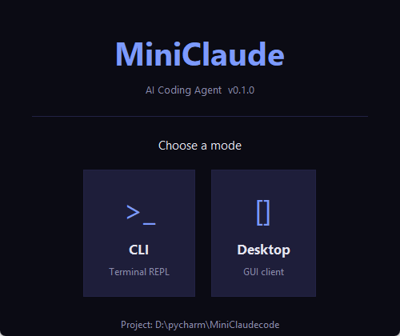
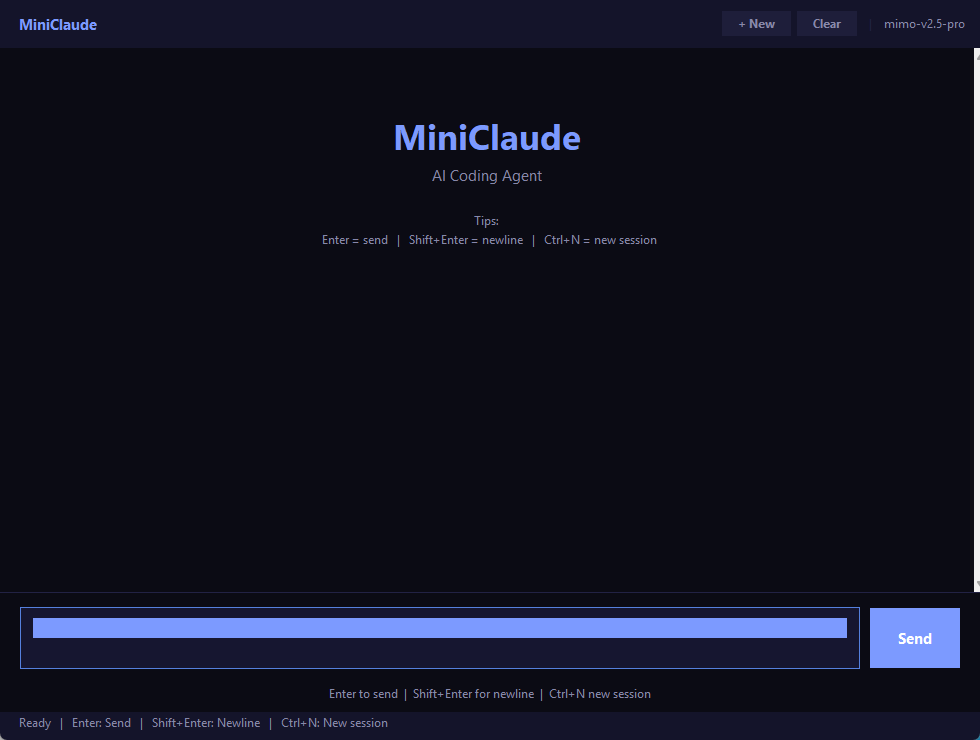
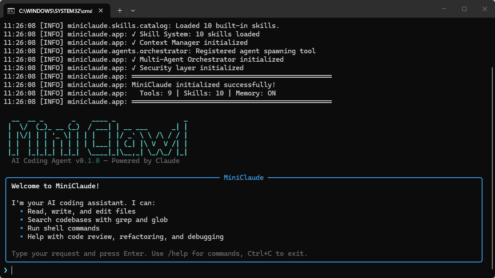
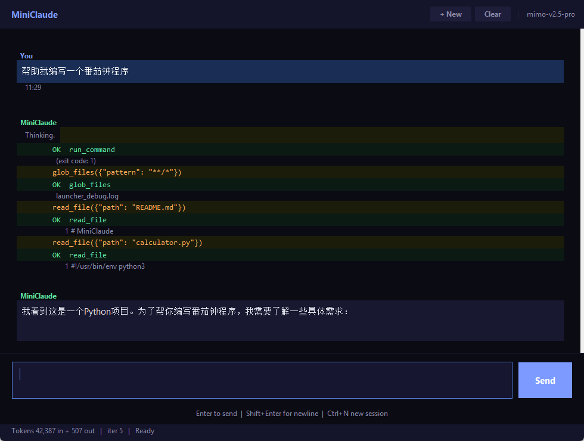

# MiniClaude

> 参考 Claude Code 架构设计并实现的 AI Coding Agent，基于 **Query Loop + Tool Use** 构建任务执行闭环。

<p align="center">
  
  
  
  
</p>

<!-- 📸 截图展示区 — 替换为你自己的截图 -->
<p align="center">
  
  &nbsp;&nbsp;
  
</p>

---

## 一、技术路线

本项目采用**分层递进**的架构设计思路，自底向上分为 6 层：

```
┌──────────────────────────────────────────────────────────────────────┐
│  Layer 6: UI 层                                                       │
│  ┌─────────────┐ ┌─────────────┐ ┌─────────────┐                    │
│  │ 终端 REPL   │ │ 桌面 GUI    │ │ 启动器      │                    │
│  │ (Rich)      │ │ (Tkinter)   │ │ (Launcher)  │                    │
│  └─────────────┘ └─────────────┘ └─────────────┘                    │
├──────────────────────────────────────────────────────────────────────┤
│  Layer 5: 安全审查层                                                  │
│  规则过滤 → 工具自检 → Prompt 注入防御 → AI 风险分类 → 人工确认      │
├──────────────────────────────────────────────────────────────────────┤
│  Layer 4: 协作调度层                                                  │
│  ┌──────────────────┐  ┌──────────────────┐                         │
│  │ 中心化编排器     │  │ 子 Agent 池      │                         │
│  │ (Orchestrator)   │  │ (4 种专业角色)   │                         │
│  └──────────────────┘  └──────────────────┘                         │
├──────────────────────────────────────────────────────────────────────┤
│  Layer 3: 知识管理层                                                  │
│  ┌──────────────────┐  ┌──────────────────┐  ┌──────────────────┐   │
│  │ Skill 路由器     │  │ 记忆系统         │  │ 上下文压缩       │   │
│  │ (二阶段召回+精排)│  │ (自进化沉淀)     │  │ (四层策略)       │   │
│  └──────────────────┘  └──────────────────┘  └──────────────────┘   │
├──────────────────────────────────────────────────────────────────────┤
│  Layer 2: 执行引擎层                                                  │
│  ┌──────────────────┐  ┌──────────────────┐  ┌──────────────────┐   │
│  │ Query Loop       │  │ Tool Executor    │  │ Context Manager  │   │
│  │ (主循环)         │  │ (工具调度)       │  │ (上下文管理)     │   │
│  └──────────────────┘  └──────────────────┘  └──────────────────┘   │
├──────────────────────────────────────────────────────────────────────┤
│  Layer 1: 基础设施层                                                  │
│  ┌──────────────┐ ┌──────────────┐ ┌──────────────┐ ┌────────────┐ │
│  │ LLM Client   │ │ Tool Registry│ │ Memory Store │ │ Token      │ │
│  │ (OpenAI 兼容)│ │ (原子工具)   │ │ (SQLite)     │ │ Counter    │ │
│  └──────────────┘ └──────────────┘ └──────────────┘ └────────────┘ │
└──────────────────────────────────────────────────────────────────────┘
```

**技术路线选择依据**：
- **Query Loop + Tool Use**：借鉴 Claude Code 的核心模式，将复杂任务分解为 LLM 推理 + 工具执行的迭代闭环
- **OpenAI 兼容协议**：不绑定单一模型供应商，通过统一接口适配 MiMo-v2.5-pro 及其他模型
- **分层解耦**：每层独立可测试，便于替换和扩展（如更换 LLM 后端、新增工具类型、自定义 Skill）

---

## 二、关键技术

### 2.1 Skill 分层路由 — 二阶段召回 + 精排

**问题**：Skill 数量增长后，全量注入 system prompt 会导致检索噪声大、Token 浪费严重。

**方案**：将工具和 Skill 分为三层组织，通过二阶段路由按需注入。

```
用户输入
   ↓
┌───────────────────────────────────┐
│ Stage 1: 粗召回 (Coarse Recall)   │  关键词匹配 + 标签过滤 + 意图分类
│  → 从 N 个 Skill 中筛选 top-10    │  时间复杂度 O(N)，毫秒级
└───────────────────────────────────┘
   ↓
┌───────────────────────────────────┐
│ Stage 2: 精排 (Fine Ranking)      │  多维评分：语义相关性 + 标签命中 +
│  → 从 10 个中选 top-3 注入 prompt │  示例相似度 + 意图关键词加分
└───────────────────────────────────┘
   ↓
注入 system prompt 的 Skill 使用指南
```

**评分公式**：`score = base_score + tag_bonus + example_bonus + intent_bonus`

**三层架构**：
| 层级 | 内容 | 数量 | 注入方式 |
|------|------|------|----------|
| Atomic Tools | `read_file`, `write_file`, `grep_search` ... | 9 | 始终注入 |
| High-level Skills | `code_review`, `refactor`, `debug` ... | 9 | 按需路由注入 |
| Skill Catalog | 元信息索引（标签、示例、适用边界） | - | 路由查询用 |

---

### 2.2 自进化记忆沉淀 — 闭环记忆管理

**问题**：跨会话时丢失程序性经验和用户偏好，导致重复推理。

**方案**：设计"执行 → 反思 → 提炼 → 分类存储 → 索引更新 → 按需复用"的闭环。

```
任务执行完成
     ↓
┌──────────────────────────────┐
│ Step 1: 反思 (Reflect)       │  调用 LLM 分析本次交互
│  "这次任务的关键决策是什么？"│  提取：关键决策、经验教训、用户偏好
└──────────────────────────────┘
     ↓
┌──────────────────────────────┐
│ Step 2: 提炼 (Distill)       │  将反思结果转化为结构化记忆条目
│  每条 < 200 字，自含上下文   │  包含类型标签 + 摘要
└──────────────────────────────┘
     ↓
┌──────────────────────────────┐
│ Step 3: 去重 (Deduplicate)   │  与已有记忆比对（相似度 > 0.8 则合并）
│  避免记忆冗余膨胀             │  合并时更新已有条目的访问时间
└──────────────────────────────┘
     ↓
┌──────────────────────────────┐
│ Step 4: 存储 (Store)         │  写入 SQLite，含三种记忆类型
└──────────────────────────────┘
     ↓
下一次会话启动时
     ↓
┌──────────────────────────────┐
│ 检索 (Retrieve)              │  根据当前查询检索相关记忆
│  → 注入 system prompt        │  用户画像始终注入，程序性记忆按需
└──────────────────────────────┘
```

**三种记忆类型**：
| 类型 | 说明 | 示例 |
|------|------|------|
| `procedural` | 程序性经验（怎么做事） | "Python 项目用 pytest 跑测试" |
| `episodic` | 情景记忆（过去交互） | "上次重构 auth 模块用了策略模式" |
| `profile` | 用户偏好画像 | "用户偏好中文注释，喜欢简洁代码" |

---

### 2.3 分层上下文压缩 — Token 预算管理

**问题**：长对话下上下文窗口溢出，导致 LLM 无法有效利用历史信息。

**方案**：构建四层压缩策略，在 Token 耗尽前逐步降级。

```
Token 使用率
  0%                                                                100%
  ├─────────────────┤─────────────────┤─────────────────┤──────────┤
  │   正常运行       │  Level 1 摘要   │  Level 2 占位   │ Level 3  │
  │                 │  大结果截断保留  │  外置化到磁盘   │ 丢弃旧消息│
  │                 │  摘要预览       │  [REF:xxx]替换  │          │
  ├─────────────────┤─────────────────┤─────────────────┤──────────┤
  0%               85%               92%               98%      100%
                    ↑ 告警阈值        ↑ 压缩阈值        ↑ 临界阈值
```

**大结果外置化流程**：
```
Tool 返回 5000 字符结果
     ↓
len(content) > 2000 ?
     ↓ Yes
保存全文到 data/externalized/{hash}.md
生成摘要（前 10 行）
     ↓
替换为：
  [结果已外置: read_file_a1b2c3.md]
  摘要: def hello(): print("Hello, World!")
  [使用 read_file 工具读取完整内容]
```

**Prompt Cache 优化**：
- System prompt 标记 `cache_control: {"type": "ephemeral"}`
- 工具 schema 保持稳定，最大化缓存命中
- 压缩后的占位符格式固定，保持前缀不变

---

### 2.4 中心化多 Agent 协作

**问题**：复杂任务需要多种专业能力，单 Agent 难以胜任。

**方案**：主 Agent 统一规划/审批/质量控制，子 Agent 以 Tool Call 方式受控执行。

```
用户: "帮我为这个模块写单元测试并审查安全性"
     ↓
主 Agent (Orchestrator)
  ├── 规划: 分解为 2 个子任务
  ├── spawn_agent(task="生成测试", agent_type="test_generator")
  │      └── 子 Agent 独立执行 (受限工具: read_file, write_file, glob)
  │           返回: 测试代码 + 覆盖率报告
  ├── spawn_agent(task="安全审查", agent_type="code_analyst")
  │      └── 子 Agent 独立执行 (受限工具: read_file, grep_search)
  │           返回: 安全问题列表
  └── 质量控制: 整合结果，补充建议，返回用户
```

**4 种专业子 Agent**：
| 角色 | 职责 | 允许的工具 |
|------|------|-----------|
| `code_analyst` | 代码分析、质量审查 | read, glob, grep |
| `test_generator` | 测试生成 | read, write, glob, grep |
| `refactor_expert` | 重构优化 | read, write, edit, grep, glob |
| `debug_specialist` | 调试排错 | read, grep, glob, shell |

**安全约束**：
- 子 Agent 不继承主 Agent 的对话上下文
- 工具白名单限制，路径边界约束
- 结果经过压缩后返回主 Agent

---

### 2.5 权限与安全审查

**问题**：AI Agent 在真实开发环境中具有文件读写和命令执行能力，需要多层防护。

**方案**：五层审查链路，逐级过滤风险操作。

```
用户输入
  ↓
┌─────────────────────────────┐
│ Layer 1: Prompt 注入防御    │  正则匹配 + 启发式规则
│  检测: "忽略指令" "system:  │  覆盖中英文注入模式
│  prompt" 角色覆盖等         │
└─────────────────────────────┘
  ↓ 安全
┌─────────────────────────────┐
│ Layer 2: 规则过滤           │  基于规则的工具调用审查
│  路径边界检查               │  阻止访问 /etc/, ~/.ssh 等
│  敏感文件检测 (.env, .key)  │  命令黑名单 (rm -rf, DROP)
│  二进制文件拦截             │  文件大小限制 (1MB)
└─────────────────────────────┘
  ↓ 通过
┌─────────────────────────────┐
│ Layer 3: 工具自检           │  每个工具内部的安全校验
│  Shell: 危险命令二次拦截    │  如 ShellTool 的 BLOCKED_COMMANDS
└─────────────────────────────┘
  ↓ 通过
┌─────────────────────────────┐
│ Layer 4: AI 风险分类 (可选) │  调用 LLM 评估操作风险等级
│  LOW → 直接执行             │  HIGH → 需人工确认
│  CRITICAL → 阻止            │
└─────────────────────────────┘
  ↓ 需确认
┌─────────────────────────────┐
│ Layer 5: 人工确认           │  终端/GUI 弹窗确认
│  用户审批后执行             │  已审批操作缓存，避免重复确认
└─────────────────────────────┘
```

---

## 三、项目结构

```
MiniClaudecode/
├── run.pyw                 # 双击启动器（Windows 无控制台）
├── run_debug.py            # 调试启动器（带控制台输出）
├── pyproject.toml          # 项目配置与依赖
├── .env.example            # 环境变量模板
│
├── miniclaude/
│   ├── __main__.py         # CLI 入口 (python -m miniclaude)
│   ├── app.py              # 应用主类，连接所有子系统
│   │
│   ├── core/               # 核心引擎
│   │   ├── loop.py         # Query Loop 主循环
│   │   ├── tool_executor.py
│   │   ├── context.py      # 对话上下文管理
│   │   └── config.py       # Pydantic Settings 配置
│   │
│   ├── llm/                # LLM 接口层
│   │   ├── client.py       # OpenAI 兼容客户端
│   │   ├── message_builder.py
│   │   └── token_counter.py
│   │
│   ├── tools/              # 原子工具层 (9 个工具)
│   │   ├── file_tools.py   # read / write / edit / glob / grep
│   │   ├── shell_tools.py  # 命令执行 (带安全过滤)
│   │   └── memory_tools.py # 记忆读写
│   │
│   ├── skills/             # Skill 路由层
│   │   ├── router.py       # 二阶段召回+精排路由器
│   │   ├── catalog.py      # Skill 目录管理
│   │   └── builtin/        # 9 个内置 Skill
│   │       ├── code_review.py   # 代码审查
│   │       ├── refactor.py      # 重构
│   │       ├── debug.py         # 调试
│   │       ├── test_gen.py      # 测试生成
│   │       ├── explain.py       # 代码解释
│   │       ├── code_gen.py      # 代码生成
│   │       ├── code_analysis.py # 代码分析
│   │       ├── code_document.py # 文档生成
│   │       ├── optimize.py      # 性能优化
│   │       └── security_scan.py # 安全扫描
│   │
│   ├── memory/             # 自进化记忆系统
│   │   ├── store.py        # SQLite 持久化存储
│   │   ├── extractor.py    # 记忆提取 (LLM 反思)
│   │   ├── retriever.py    # 记忆检索
│   │   └── compressor.py   # 记忆压缩/清理
│   │
│   ├── context/            # 分层上下文压缩
│   │   ├── manager.py      # 上下文管理器
│   │   ├── externalizer.py # 大结果外置化
│   │   ├── compressor.py   # 历史消息压缩
│   │   ├── placeholder.py  # 占位符管理
│   │   └── budget.py       # Token 预算管理
│   │
│   ├── agents/             # 多 Agent 协作
│   │   ├── orchestrator.py # 中心化编排器
│   │   ├── sub_agent.py    # 子 Agent (4 种角色)
│   │   ├── team.py         # Agent Team 并行执行
│   │   └── worktree.py     # 隔离工作空间
│   │
│   ├── security/           # 权限与安全审查
│   │   ├── permission.py   # 多层权限检查链
│   │   ├── rules.py        # 规则过滤器
│   │   ├── prompt_guard.py # Prompt 注入防御
│   │   ├── risk_classifier.py # AI 风险分类
│   │   └── auditor.py      # 审计日志
│   │
│   └── ui/                 # 用户界面
│       ├── repl.py         # 终端 REPL (Rich)
│       ├── desktop.py      # 桌面 GUI (Tkinter)
│       ├── renderer.py     # Rich 渲染器
│       └── launcher.py     # 模式选择启动器
│
├── tests/                  # 测试套件 (42 个测试用例)
│   ├── test_tools.py
│   ├── test_memory.py
│   ├── test_context.py
│   └── test_security.py
│
└── docs/                   # 截图与文档
    └── (截图文件)
```

---

## 四、快速开始

```bash
# 1. 克隆
git clone https://github.com/a805026135/MiniClaude.git
cd MiniClaude

# 2. 安装
pip install -e .

# 3. 配置
cp .env.example .env
# 编辑 .env 填入 API Key

# 4. 启动
python run.pyw              # 启动器（选择 CLI 或 Desktop）
python -m miniclaude        # 直接进入终端 REPL
python -m miniclaude --gui  # 直接进入桌面 GUI
```

---

## 五、技术栈

| 组件 | 技术选型 | 选择理由 |
|------|----------|----------|
| LLM 后端 | OpenAI 兼容 API | 不绑定单一供应商，可切换模型 |
| 目标模型 | MiMo-v2.5-pro | 小米推理模型，Tool Calling 支持良好 |
| 数据建模 | Pydantic v2 | 类型安全，自动序列化，适合配置与数据模型 |
| 持久化 | SQLite + aosqlite | 零配置，异步读写，适合本地 Agent |
| 终端 UI | Rich | 美观的终端渲染，支持 Markdown、表格、语法高亮 |
| 桌面 UI | Tkinter | Python 内置，零额外依赖，跨平台 |
| CLI 框架 | Typer | 现代 CLI 框架，自动帮助文档 |
| Token 计数 | tiktoken | OpenAI 官方 Token 计数器 |

---

## 六、截图展示

<!-- 📸 截图占位 — 截图后替换以下图片路径 -->

### 模式选择启动器

<p align="center">
  
</p>

> 双击 `run.pyw` 弹出模式选择窗口，支持 CLI 终端模式和桌面 GUI 模式。

### 桌面客户端

<p align="center">
  
</p>

> 聊天界面展示：用户消息、AI 回复、工具调用（`read_file`、`glob_files`）的完整流程。

### 终端 REPL

<p align="center">
  
</p>

> Rich 渲染的终端交互界面，展示 Markdown 格式的 AI 回复和工具执行状态。

### 工具调用演示

<p align="center">
  
</p>

> 展示 AI Agent 通过 Tool Use 自主读取文件、搜索代码、执行命令的过程。

---

## 七、配置参考

| 环境变量 | 默认值 | 说明 |
|----------|--------|------|
| `MINICLAUDE_API_KEY` | (必填) | API 密钥 |
| `MINICLAUDE_API_BASE_URL` | `https://token-plan-cn.xiaomimimo.com/v1` | API 端点 |
| `MINICLAUDE_MODEL` | `mimo-v2.5-pro` | 模型标识 |
| `MINICLAUDE_MAX_TOKENS` | `8192` | 单次最大输出 Token |
| `MINICLAUDE_TEMPERATURE` | `0.6` | 采样温度 |
| `MINICLAUDE_CONTEXT_LIMIT` | `131072` | 上下文窗口大小 |
| `MINICLAUDE_EXTERNALIZE_THRESHOLD` | `2000` | 大结果外置化阈值（字符数） |
| `MINICLAUDE_MEMORY_ENABLED` | `true` | 是否启用记忆系统 |
| `MINICLAUDE_ALLOW_SHELL` | `true` | 是否允许 Shell 命令 |
| `MINICLAUDE_CONFIRM_DANGEROUS` | `true` | 危险操作是否需要确认 |

---

## 八、测试

```bash
pip install -e ".[dev]"
python -m pytest tests/ -v
```

```
tests/test_tools.py     ✓ 18 tests  (文件工具 / Shell 工具)
tests/test_memory.py    ✓  8 tests  (记忆存储 / 检索)
tests/test_context.py   ✓  4 tests  (Token 预算 / 外置化 / 压缩)
tests/test_security.py  ✓ 12 tests  (规则过滤 / Prompt 注入防御)
──────────────────────────────────
Total: 42 passed
```

---

## 截图指南

> 截取以下 4 张图放入 `docs/` 目录，提交后 README 自动显示。
>
> | 文件名 | 内容 |
> |--------|------|
> | `docs/screenshot_launcher.png` | 双击 `run.pyw` 后的模式选择窗口 |
> | `docs/screenshot_desktop.png` | Desktop GUI 完整对话界面 |
> | `docs/screenshot_repl.png` | 终端 REPL 交互界面 |
> | `docs/screenshot_tool_call.png` | AI 调用工具的过程 |
>
> 工具：`Win + Shift + S` 截图，保持暗色主题，缩放 150% 效果最佳。

---

## License

MIT
